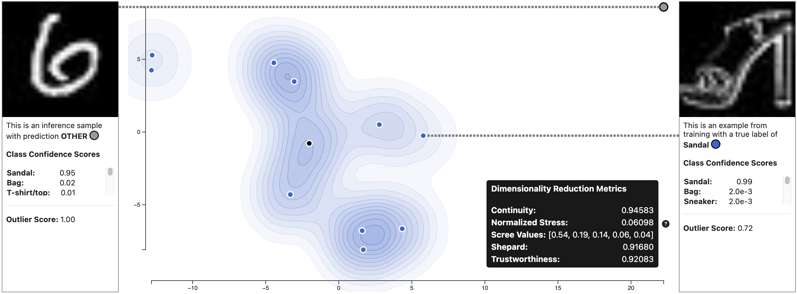

# EQUINE Webapp

<p align="center">
  
</p>


<p align="center">
  This is a web application utilizing EQUINE for neural network uncertainty quantification through a visual user interface. The webapp allows you to upload your own model and data, and let the server retrain the model with EQUINE. The visualization dashboard also allows you to analyze your samples and view uncertainty quantification visualizations to explain model uncertainty.
</p>

<p align="center">
  The EQUINE repository is here https://github.com/mit-ll-responsible-ai/equine
</p>

## ScatterUQ at IEEE VIS 2023
We presented ScatterUQ at IEEE VIS 2023: https://ieeexplore.ieee.org/document/10360884

Our data and analysis script can be found in this release: https://github.com/mit-ll-responsible-ai/equine-webapp/releases/tag/ScatterUQ-VIS-2023-Data

## React Frontend

### ScatterUQ Static Demo
We deployed the frontend application to GitHub pages. You can view a static demo of ScatterUQ here:

https://mit-ll-responsible-ai.github.io/equine-webapp/demo

[](https://mit-ll-responsible-ai.github.io/equine-webapp/demo)

### Development Frontend Server Setup
1. Install node packages
```
cd client
npm i
```

2. Start the development server
```
npm run dev
```


## Python Flask Server

### Development Flask Server Setup
1. Create a new Anaconda environment
```
conda create --name equine-webapp python=3.10
```

2. Activate your new environment
```
conda activate equine-webapp
```

3. Install the necessary packages from pip
```
pip install -r requirements.txt
```

4. Start the Flask server
```
python start_dev_server.py
```

### Flask Testing
If you'd like to run our flask tests:
1. Install pytest
```
pip install pytest
```

2. Run pytest
```
python -m pytest
```

## Bibliography

```
@INPROCEEDINGS{10360884,
  author={Li, Harry X. and Jorgensen, Steven and Holodnak, John and Wollaber, Allan B.},
  booktitle={2023 IEEE Visualization and Visual Analytics (VIS)}, 
  title={ScatterUQ: Interactive Uncertainty Visualizations for Multiclass Deep Learning Problems}, 
  year={2023},
  volume={},
  number={},
  pages={246-250},
  keywords={Deep learning;Dimensionality reduction;Training;Uncertainty;Visual analytics;Soft sensors;Interactive systems;Uncertainty quantification;Machine learning;Dimensionality reduction;Visualization;Explainable AI},
  doi={10.1109/VIS54172.2023.00058}}
```

## Disclaimer

DISTRIBUTION STATEMENT A. Approved for public release. Distribution is unlimited.

© 2023 MASSACHUSETTS INSTITUTE OF TECHNOLOGY

- Subject to FAR 52.227-11 – Patent Rights – Ownership by the Contractor (May 2014)
- SPDX-License-Identifier: MIT

This material is based upon work supported by the Under Secretary of Defense for Research and Engineering under Air Force Contract No. FA8702-15-D-0001. Any opinions, findings, conclusions or recommendations expressed in this material are those of the author(s) and do not necessarily reflect the views of the Under Secretary of Defense for Research and Engineering.

The software/firmware is provided to you on an As-Is basis.
